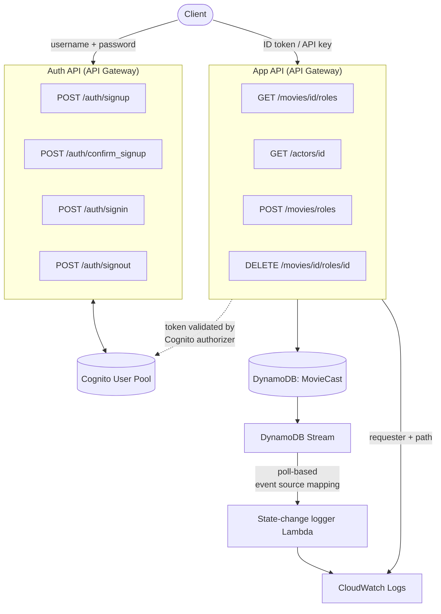

# Serverless REST API — Movie Cast

**Name:** _[your name]_
**Student ID:** _[your student ID]_
**Demo video:** _[YouTube URL]_

A secure, serverless Web API for managing movie cast information, deployed to AWS and
provisioned entirely with the AWS CDK (TypeScript). The application uses API Gateway,
Lambda, DynamoDB (single-table design), Cognito and CloudWatch.

---

## Contents

- [Architecture](#architecture)
- [Data model](#data-model)
- [API endpoints](#api-endpoints)
- [Authentication and authorisation](#authentication-and-authorisation)
- [Logging](#logging)
- [Database seeding](#database-seeding)
- [Project structure](#project-structure)
- [Setup and deployment](#setup-and-deployment)
- [Usage walkthrough](#usage-walkthrough)
- [Features implemented](#features-implemented)

---

## Architecture

Two separate REST APIs are provisioned by a single CDK stack: an **Auth API** that handles
user account management against a Cognito user pool, and the **App API** that serves the
movie cast resources. All persistence is in one DynamoDB table, whose stream drives an
audit-logging Lambda.



**Request flow.** A user registers and signs in through the Auth API, receiving a Cognito
ID token. That token is presented to the App API's read endpoints, where an API Gateway
Cognito user pool authorizer validates it before the Lambda is invoked. Write endpoints
are gated by an API Gateway API key instead, held only by the administrator. Each handler
writes a request-audit line to CloudWatch, and every database mutation independently
triggers the state-change logger via the table's stream.

---

## Data model

Three entity types are stored, following the **single-table design** pattern. Item type is
distinguished by prefixes on the partition and sort keys.

| Entity | PK          | SK          | Attributes                                     |
| ------ | ----------- | ----------- | ---------------------------------------------- |
| Movie  | `m#movieId` | `m#movieId` | `movieId`, `title`, `releaseDate`, `overview`  |
| Actor  | `a#actorId` | `a#actorId` | `actorId`, `name`, `dateOfBirth`, `bio`        |
| Role   | `m#movieId` | `a#actorId` | `movieId`, `actorId`, `roleName`, `roleDescription` |

Every item also carries an `entityType` attribute (`MOVIE` / `ACTOR` / `ROLE`), which the
state-change logger uses to decide which fields to report.

**Why this key design works.** Because a role's partition key is the *movie* and its sort
key is the *actor*, all roles for a given movie form a single item collection. Fetching a
movie's full cast is therefore one `Query` on `PK = m#<id>` with `begins_with(SK, "a#")`,
and fetching one specific role is a direct `GetItem` — no scans anywhere in the
application. The same actor can hold different roles in different movies without conflict,
since each role item is uniquely identified by the movie/actor pair.

Key construction is centralised in [`shared/keys.ts`](shared/keys.ts) so that no handler
builds prefixed keys by hand.

---

## API endpoints

### App API

| Method   | Path                                | Auth     | Description                                              |
| -------- | ----------------------------------- | -------- | -------------------------------------------------------- |
| `GET`    | `/movies/{movieID}/roles`           | Cognito  | All roles for a movie                                     |
| `GET`    | `/movies/{movieID}/roles?actor={id}`| Cognito  | Only the role played by that actor in that movie          |
| `GET`    | `/actors/{actorID}`                 | Cognito  | The actor's bio                                           |
| `GET`    | `/actors/{actorID}?movie={id}`      | Cognito  | Bio **plus** the actor's role in the specified movie       |
| `POST`   | `/movies/roles`                     | API key  | Add a movie role                                          |
| `DELETE` | `/movies/{movieID}/roles/{actorID}` | API key  | Delete the specified movie role                           |

`POST /movies/roles` expects:

```json
{
  "movieId": 1234,
  "actorId": 4321,
  "roleName": "Ellis Boyd \"Red\" Redding",
  "roleDescription": "Serves as the film's narrator, deuteragonist and emotional anchor."
}
```

The handler validates the body and confirms that both the referenced movie and actor
already exist before writing, returning `404` if either is missing.

### Auth API

| Method | Path                    | Description                                       |
| ------ | ----------------------- | ------------------------------------------------- |
| `POST` | `/auth/signup`          | Self-registration; triggers a confirmation email   |
| `POST` | `/auth/confirm_signup`  | Confirm the account with the emailed code          |
| `POST` | `/auth/signin`          | Returns an ID token and an access token            |
| `POST` | `/auth/signout`         | Globally revokes the supplied access token         |

`/auth/signin` returns the **ID token** (presented to the App API as
`Authorization: Bearer <token>`) and the **access token** (required by `/auth/signout`).

### Response codes

Cognito exceptions are mapped to meaningful HTTP statuses rather than a blanket `500`:

| Condition                    | Status | Error                        |
| ---------------------------- | ------ | ---------------------------- |
| Username already registered  | `409`  | `UsernameExistsException`     |
| Password fails pool policy   | `400`  | `InvalidPasswordException`    |
| Wrong confirmation code      | `400`  | `CodeMismatchException`       |
| Account not yet confirmed    | `403`  | `UserNotConfirmedException`   |
| Wrong username or password   | `401`  | `NotAuthorizedException`      |

---

## Authentication and authorisation

The application has the two forms of authentication required by the specification.

**Users — Cognito username and password.** A dedicated Auth API allows self-registration,
email confirmation, sign-in and sign-out against a Cognito user pool
([`lib/constructs/auth-api.ts`](lib/constructs/auth-api.ts)). The pool permits sign-in by
either username or email and has self-signup enabled.

**Administrator — API key.** An `ApiKey` is generated at deployment time by API Gateway and
associated with a `UsagePlan` covering the deployed stage. A key has no effect until it is
attached to a usage plan, so both resources are created together in
[`lib/constructs/movie-cast-api.ts`](lib/constructs/movie-cast-api.ts).

Authorisation is enforced at the API Gateway layer, before any Lambda is invoked:

| Requests          | Mechanism                              | Header                      |
| ----------------- | -------------------------------------- | --------------------------- |
| `GET`             | `CognitoUserPoolsAuthorizer`           | `Authorization: Bearer <ID token>` |
| `POST` / `DELETE` | `apiKeyRequired` + usage plan          | `x-api-key: <key>`          |

These are genuinely independent: a signed-in ordinary user presenting a valid ID token to
a write endpoint receives `403`, because authentication as a user does not confer
administrator rights.

Unauthenticated reads return `401`; writes without a valid key return `403`.

---

## Logging

Two separate logging mechanisms are implemented, both writing to CloudWatch Logs.

### User activity logging

[`lambda/common/logging.ts`](lambda/common/logging.ts) is invoked at the start of every
request handler. It reads the requester's identity from the Cognito claims injected by the
authorizer (`event.requestContext.authorizer.claims["cognito:username"]`) and reconstructs
the request path including any query string:

```
smoketest      /movies/1234/roles
smoketest      /movies/1234/roles?actor=9911
smoketest      /actors/4321?movie=1234
administrator  /movies/roles
administrator  /movies/5678/roles/9911
```

Write requests authenticate by API key and therefore carry no Cognito identity; they are
recorded as `administrator` so that the audit trail covers every request rather than reads
only.

### Database state-change logging

The DynamoDB table is created with a stream
(`StreamViewType.NEW_AND_OLD_IMAGES`). A `DynamoEventSource` mapping
([`lib/constructs/state-change-logger.ts`](lib/constructs/state-change-logger.ts)) causes
the Lambda service to poll that stream and invoke
[`lambda/stream/logStateChange.ts`](lambda/stream/logStateChange.ts) with batches of change
records — the poll-based integration model.

DynamoDB's physical operations are mapped to the HTTP verbs that caused them
(`INSERT`→`POST`, `REMOVE`→`DELETE`, `MODIFY`→`PUT`), producing entries such as:

```
POST    m#5678 | a#9911 | Rachel Dawes | Gotham's assistant district attorney and Bruce Wayne's childhood friend.
DELETE  m#5678 | a#9911 | Rachel Dawes | Gotham's assistant district attorney and Bruce Wayne's childhood friend.
```

Deletions read the record's `OldImage`, since a removed item has no new state; all other
operations read `NewImage`.

> **Note.** The event source mapping uses `StartingPosition.LATEST`, so it begins reading
> from the tip of the stream. Immediately after a fresh deployment there is a short window
> before the poller becomes active, during which writes are not captured. Allow roughly a
> minute after `cdk deploy` before expecting state-change entries.

---

## Database seeding

Movies and actors have no create endpoint — only roles are created and deleted through the
API — so the table is populated at deployment time by an `AwsCustomResource` that issues a
`BatchWriteItem` ([`lib/constructs/movie-cast-seeder.ts`](lib/constructs/movie-cast-seeder.ts)).
The custom resource runs on both create and update, so redeploying restores the seed data.

The seed set ([`lib/constructs/seed-data.ts`](lib/constructs/seed-data.ts)) contains
**3 movies, 4 actors and 5 roles** (12 items). It deliberately casts one actor
(Morgan Freeman, `a#4321`) in two different movies with different roles, which exercises
the key design described above.

---

## Project structure

```
movie-cast-api/
├── bin/
│   └── movie-cast-api.ts              CDK app entry point
├── lib/
│   ├── movie-cast-api-stack.ts        Stack composition and outputs
│   └── constructs/
│       ├── movie-cast-table.ts        DynamoDB single table + stream
│       ├── movie-cast-seeder.ts       Deploy-time seeding custom resource
│       ├── seed-data.ts               Sample movies, actors and roles
│       ├── movie-cast-api.ts          App API, Lambdas, authorizer, API key
│       ├── auth-api.ts                Cognito user pool and Auth API
│       └── state-change-logger.ts     Stream event source mapping
├── lambda/
│   ├── actors/getActor.ts
│   ├── movies/{getMovieRoles,addMovieRole,deleteMovieRole}.ts
│   ├── auth/{signup,confirmSignup,signin,signout,cognitoClient}.ts
│   ├── stream/logStateChange.ts
│   └── common/                        ddbClient, http, mappers, logging
└── shared/                            types, authTypes, key builders
```

Infrastructure is decomposed into focused constructs rather than one monolithic stack
class, so each concern (persistence, seeding, app API, auth, audit) is independently
readable.

---

## Setup and deployment

### Prerequisites

- Node.js 20+
- AWS CLI configured with credentials (`aws sts get-caller-identity` to verify)
- AWS CDK CLI (`npm install -g aws-cdk`)

### Deploy

```bash
npm install
npx cdk bootstrap        # once per account/region
npm run build            # typecheck
npx cdk deploy
```

Deployment prints the values needed to use the API:

```
MovieCastApiStack.ApiUrl           = https://<id>.execute-api.<region>.amazonaws.com/prod/
MovieCastApiStack.AuthApiUrl       = https://<id>.execute-api.<region>.amazonaws.com/prod/
MovieCastApiStack.UserPoolId       = <region>_XXXXXXXXX
MovieCastApiStack.UserPoolClientId = xxxxxxxxxxxxxxxxxxxxxxxxxx
MovieCastApiStack.AdminApiKeyId    = xxxxxxxxxx
```

The API key **value** is deliberately not published as a stack output. Retrieve it with:

```bash
aws apigateway get-api-key --api-key <AdminApiKeyId> --include-value --query value --output text
```

Other useful commands:

```bash
npx cdk diff       # what would change against the deployed stack
npx cdk synth      # generate the CloudFormation template into cdk.out/
npx cdk destroy    # remove all resources
```

---

## Usage walkthrough

```bash
AUTH="<AuthApiUrl>"
API="<ApiUrl>"
```

**1. Register and confirm a user**

```bash
curl -X POST "$AUTH/auth/signup" -H "Content-Type: application/json" \
  -d '{"username":"jbloggs","password":"Passw0rd!","email":"jbloggs@example.com"}'

curl -X POST "$AUTH/auth/confirm_signup" -H "Content-Type: application/json" \
  -d '{"username":"jbloggs","code":"123456"}'
```

**2. Sign in and capture the ID token**

```bash
curl -X POST "$AUTH/auth/signin" -H "Content-Type: application/json" \
  -d '{"username":"jbloggs","password":"Passw0rd!"}'
```

**3. Read as an authenticated user**

```bash
curl "$API/movies/1234/roles"            -H "Authorization: Bearer $ID_TOKEN"
curl "$API/movies/1234/roles?actor=4321" -H "Authorization: Bearer $ID_TOKEN"
curl "$API/actors/4321"                  -H "Authorization: Bearer $ID_TOKEN"
curl "$API/actors/4321?movie=2001"       -H "Authorization: Bearer $ID_TOKEN"
```

**4. Write as the administrator**

```bash
curl -X POST "$API/movies/roles" -H "Content-Type: application/json" -H "x-api-key: $API_KEY" \
  -d '{"movieId":5678,"actorId":9911,"roleName":"Rachel Dawes","roleDescription":"Gotham'\''s assistant district attorney."}'

curl -X DELETE "$API/movies/5678/roles/9911" -H "x-api-key: $API_KEY"
```

**5. Inspect the logs**

CloudWatch → Log groups → `/aws/lambda/MovieCastApiStack-*`. The handler log groups contain
the user activity entries; the `StateChangeLogger` group contains the database audit trail.

---

## Features implemented

| Requirement                                              | Status |
| -------------------------------------------------------- | ------ |
| `GET /movies/{movieID}/roles` with optional `actor` filter | Done |
| `GET /actors/{actorID}` with optional `movie` parameter    | Done |
| `POST /movies/roles`                                       | Done |
| `DELETE /movies/{movieID}/roles/{actorID}`                 | Done |
| Single-table DynamoDB design with prefixed keys             | Done |
| Database seeding                                            | Done |
| Cognito Auth API — self-register, log in, log out            | Done |
| API key authentication for the administrator                 | Done |
| Authorisation — users read, administrator writes             | Done |
| User activity logging to CloudWatch                          | Done |
| Database state-change logging to CloudWatch                  | Done |
| Infrastructure provisioned with the CDK                      | Done |

**Not implemented:** Lambda layers and a multi-stack app (the Outstanding-tier
infrastructure options). The application is deployed as a single stack composed of six
constructs.
